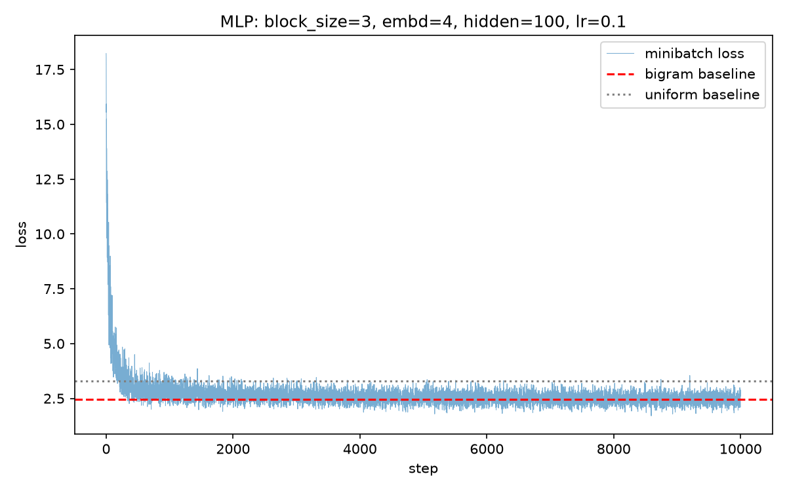

# makemore — character-level language models from scratch

Character-level models of names, each one earning its keep against the last.
Following Andrej Karpathy's makemore lectures, written from memory rather than
copied.

| model | context | NLL | perplexity |
| --- | --- | --- | --- |
| uniform over 27 characters | none | 3.2958 | 27.0 |
| bigram, counted | 1 char | 2.4546 | 11.6 |
| bigram, gradient descent | 1 char | ≈ 2.45 | ≈ 11.6 |
| MLP with embeddings | `block_size` (3 by default) | see below | |

Perplexity reads as an effective number of choices: one character of context
narrows the next character from 27 possibilities to about 12. The loss cannot
reach zero — its floor is the entropy of the names themselves.

---

# 1. Bigram

Predict each character from the one before it. With `.` as the start/end token
the vocabulary is $V = 27$, the corpus gives $N = 228{,}146$ character pairs, and
the model is a single $27 \times 27$ table of conditional probabilities.

Run with `python bigram.py`.

## Two routes to the same table

**Counting.** Tally every observed pair into a $27 \times 27$ matrix, add one to
every entry, normalise each row. Closed form, no optimisation.

**Gradient descent.** A single weight matrix $W$ of the same shape, trained on
the negative log-likelihood

$$\mathcal{L} = -\frac{1}{N}\sum_{\alpha=1}^{N} \log P_{\alpha, y_\alpha},
\qquad P_{\alpha j} = \frac{\exp Z_{\alpha j}}{\sum_k \exp Z_{\alpha k}},
\qquad Z_{\alpha j} = \sum_i X_{\alpha i} W_{ij}$$

with $\alpha$ indexing training examples and $i,j,k$ indexing characters.

The second route converges to the first. That is the point: the neural network
does not learn something cleverer than counting, it *rediscovers* counting — and
unlike counting it keeps working when the context grows beyond one character.

## Smoothing is regularisation

Add-one smoothing in the count model and the L2 penalty `0.01 * (W**2).mean()` in
the trained model do the same job. Both pull the distribution toward uniform and
prevent any pair from being assigned zero probability. Remove the L2 term and the
trained model matches the *unsmoothed* counts instead. The two knobs are the same
knob.

---

# 2. MLP with character embeddings

Following Bengio et al. 2003. Run with `python example_MLP.py`.

`block_size` characters of context instead of one — three by default, but it is a
constructor argument and the whole model follows from it. A lookup table over
$b$ characters would need $27^{\,b}$ rows, which is already $\approx 19{,}700$ at
$b = 3$ and hopeless beyond: most rows would never be observed in 32k names.

Embeddings avoid that. Each character maps to a learned vector of dimension
$d$ = `embd_dim`, the $b$ context vectors are concatenated into one of length
$b\,d$, and a hidden layer of size `h_dim` reads the result:

$$X \;(N \times b) \;\xrightarrow{\;C\;}\; (N \times b \times d) \;\xrightarrow{\text{reshape}}\; (N \times bd) \;\xrightarrow{\;W_1, b_1,\ \tanh\;}\; (N \times h) \;\xrightarrow{\;W_2, b_2\;}\; (N \times 27)$$

with $C$ of shape $(27, d)$, $W_1$ of shape $(bd, h)$ and $W_2$ of shape
$(h, 27)$. Parameter count grows *linearly* in $b$, where the lookup table grew
exponentially — that is the whole trick. Characters that behave alike end up with
nearby embeddings, so the model generalises to contexts it has never seen, which
is exactly what the count table cannot do.

## Structure

`MLP.py` holds the class; `example_MLP.py` is one configured experiment.

| method | |
| --- | --- |
| `makeXY()` | build $X$ of shape $(N, b)$ and $Y$ of shape $(N,)$, context reset per name |
| `build_data()` | shuffle into 80/10/10 train / dev / test |
| `init_params()` | $C$, $W_1$, $b_1$, $W_2$, $b_2$ |
| `forward()` | one pass, shared by training and evaluation so the two cannot drift |
| `evo_loss()` | minibatch SGD, returns the loss history |
| `evaluate()` | whole-split loss under `no_grad` |

## Seeding

`seed` is a constructor argument; `seed=None` disables seeding entirely and every
run differs. `split_seed` is kept separate, so the same train/dev/test partition
can be held fixed while the initialisation varies — that is how you tell whether
a result is the model or one lucky draw. Weight initialisation and minibatch
sampling draw from independent generators, so changing the number of training
steps cannot change the starting weights.

## Two things left deliberately wrong

The weights are initialised with plain `torch.randn`, unscaled. makemore 3 opens
by showing why that is wrong and what to divide by; seeing it fail first is the
exercise.

There is no learning-rate schedule. The rate is constant for the whole run.

---

## Files

| File | |
| --- | --- |
| `bigram.py` | both bigram models, sampling, figures |
| `MLP.py` | the MLP class |
| `example_MLP.py` | one configured MLP experiment, with baselines and diagnostics |
| `names.txt` | 32k names, one per line |
| `bigram.png`, `mlp_loss.png` | generated figures |

## Notes

`bigram.py` computes `exp` → normalise → `log` explicitly rather than calling
`F.cross_entropy`. That is deliberate — the manual version is what the derivation
looks like — but it is not the form to use in real code: `logits.exp()` overflows
once any logit exceeds about 88 in float32, and the fused version has a cleaner
backward pass, $\partial\mathcal{L}/\partial Z = (P - Y)/N$. `MLP.py` uses the
fused version.

The one-hot encoding in `bigram.py` is likewise deliberate. `W[xs]` is identical
and allocates nothing, while the one-hot matrix costs about 25 MB; writing it out
makes visible that an embedding lookup *is* a matrix multiplication. `MLP.py` uses
the lookup.

## Next

makemore 3: initialisation scale, activation statistics and BatchNorm — why the
`randn` above is wrong. Then makemore 4, the backward pass computed by hand for
every parameter and checked against autograd.
